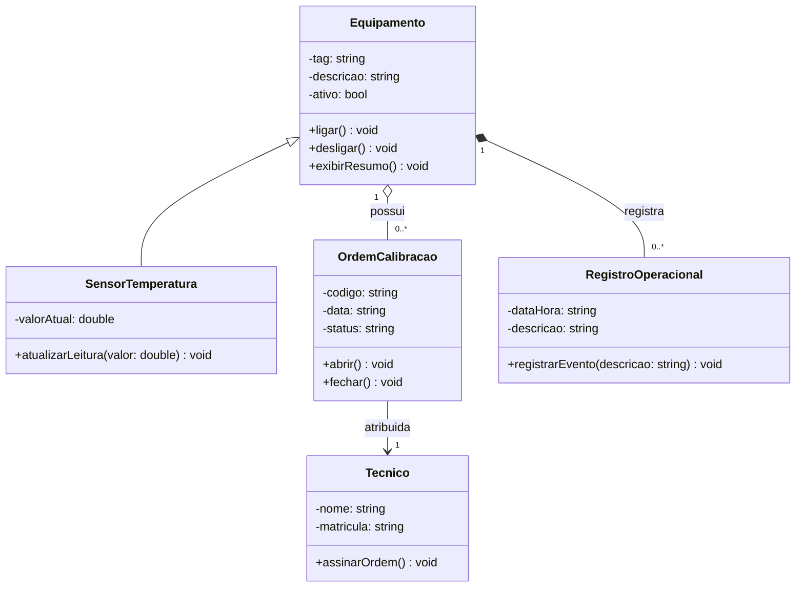

# Diagrama de Classe - Entrega do Aluno

## 1. Requisito resumido

O laboratorio de ensaios precisa controlar equipamentos e sensores de temperatura.
Cada equipamento possui identificacao, descricao e estado operacional.
Sensores de temperatura registram a leitura atual do ambiente ou do processo monitorado.
Quando um equipamento precisa de verificacao metrologica, uma ordem de calibracao deve ser aberta.
A ordem registra codigo, data, status e o tecnico responsavel pela execucao.
O modelo tambem registra eventos operacionais associados ao equipamento.

## 2. Link do Mermaid Live

https://mermaid.live/edit#pako:eNqVVE1v2zAM_SsGT2nzgTRN4lgYBgxdgR0GFOh6KnyhbdYRZkkZJQVds_z3yU6z2YlboDpZ75F81CPhHeSmIBCQV2jtV4klo0p1FE6DRLe_vNygIu1MtDsQ9Rk7LEVkHUtdttCCbM4yR9PDoZPbgGfGVP_RYSVL5MFFtDWyaMGh0BsMPctM8j1Zr0yH3ae63fgP0tbwA6kNMTrP2Gl_i5XhL85jJaLC-KyilgTWuHxB_k6yzhw00cfAdzTvuCB1E3IzxmBCRzH4LMs-Xwp02ANbF9qw58QQM5Y9vjxRvj7x66S7B8q1zLtdaaOoR1xhQHJfYZ--tVIjN299T-6eShmSzV09gFwajVVHun73N8P4sTUa8qEs8u22XsrBWWxvS-01_vRnPD5fj_O4FK5SiEwITmE6mVyGy-mARbQx1np5SD5lx-PPr0WO1ouoNjbzsnhT77Kt1-ehiI4WpBpGULIsQDj2NAJFrLC-QmN0Cm5NilIQ4bNA_plCqvchZ4P60Rh1TGPjyzWIJ6xsuPlNmAy9_gr-oUy6IL4xXjsQq-umBogdPINIVpP59dUynsazJJnP5osR_AaxnE3ieZIkqzhZxMtA7Ufw0ohOJ6t4sf8Lqg1kwQ

## 3. Diagrama final em Mermaid



## 4. Justificativa das relacoes

- A generalizacao entre `Equipamento` e `SensorTemperatura` foi usada porque o sensor tambem possui identificacao, descricao e estado operacional.
- A agregacao entre `Equipamento` e `OrdemCalibracao` indica que um equipamento pode possuir nenhuma ou varias ordens de calibracao ao longo do tempo.
- A associacao entre `OrdemCalibracao` e `Tecnico` representa o tecnico responsavel pela execucao ou assinatura da ordem.
- A composicao entre `Equipamento` e `RegistroOperacional` indica que os registros fazem sentido dentro do historico de um equipamento especifico.
- A cardinalidade `1` para `0..*` foi escolhida porque um equipamento pode ter varios registros e varias ordens, mas cada registro ou ordem pertence a um equipamento no contexto do modelo.
- As classes fazem sentido no dominio porque representam os principais elementos descritos no requisito: equipamentos, sensores, calibracoes, tecnico responsavel e estado operacional.

## 5. Linguagem escolhida

Marque a trilha usada:

- [x] C++
- [ ] Python

## 6. Evidencias de execucao

### Validacao Mermaid Live

Link registrado na seção 2 deste documento.

### Execucao da implementacao em C++

Comando de compilacao:

```bash
g++ -std=c++17 -Wall -Wextra -O2 src_cpp/main.cpp src_cpp/equipamento.cpp src_cpp/sensor_temperatura.cpp -o build/laboratorio.exe
