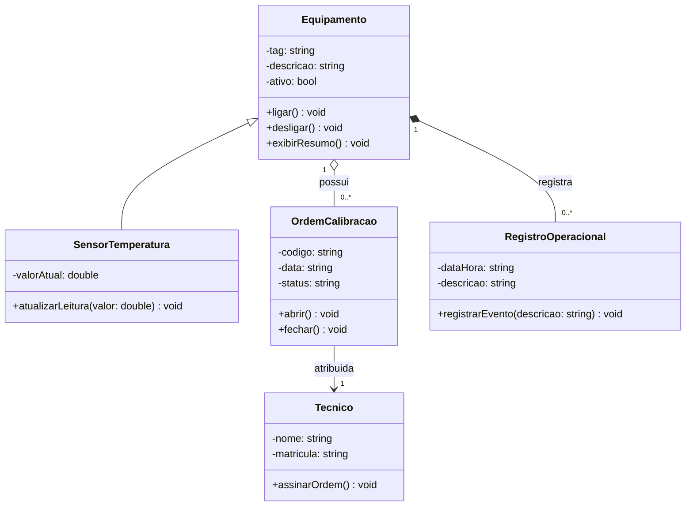

# Diagrama de Classe - Entrega do Aluno

## 1. Requisito resumido

O laboratorio de ensaios precisa controlar equipamentos e sensores de temperatura.
Cada equipamento possui identificacao, descricao e estado operacional.
Sensores de temperatura registram a leitura atual do ambiente ou do processo monitorado.
Quando um equipamento precisa de verificacao metrologica, uma ordem de calibracao deve ser aberta.
A ordem registra codigo, data, status e o tecnico responsavel pela execucao.
O modelo tambem registra eventos operacionais associados ao equipamento.

## 2. Link do Mermaid Live

A preencher apos validacao no Mermaid Live.

## 3. Diagrama final em Mermaid

## 4. Justificativa das relacoes

- A generalizacao entre `Equipamento` e `SensorTemperatura` foi usada porque o sensor tambem possui identificacao, descricao e estado operacional.
- A agregacao entre `Equipamento` e `OrdemCalibracao` indica que um equipamento pode possuir nenhuma ou varias ordens de calibracao ao longo do tempo.
- A associacao entre `OrdemCalibracao` e `Tecnico` representa o tecnico responsavel pela execucao ou assinatura da ordem.
- A composicao entre `Equipamento` e `RegistroOperacional` indica que os registros fazem sentido dentro do historico de um equipamento especifico.
- A cardinalidade `1` para `0..*` foi escolhida porque um equipamento pode ter varios registros e varias ordens, mas cada registro ou ordem pertence a um equipamento no contexto do modelo.
- As classes fazem sentido no dominio porque representam os principais elementos descritos no requisito: equipamentos, sensores, calibracoes, tecnico responsavel e estado operacional.

## 5. Linguagem escolhida

Marque a trilha usada:

- [x] C++
- [ ] Python

## 6. Evidencias de execucao

A validacao no Mermaid Live sera registrada na Issue 2.
A execucao local da implementacao em C++ sera registrada na Issue 3.
